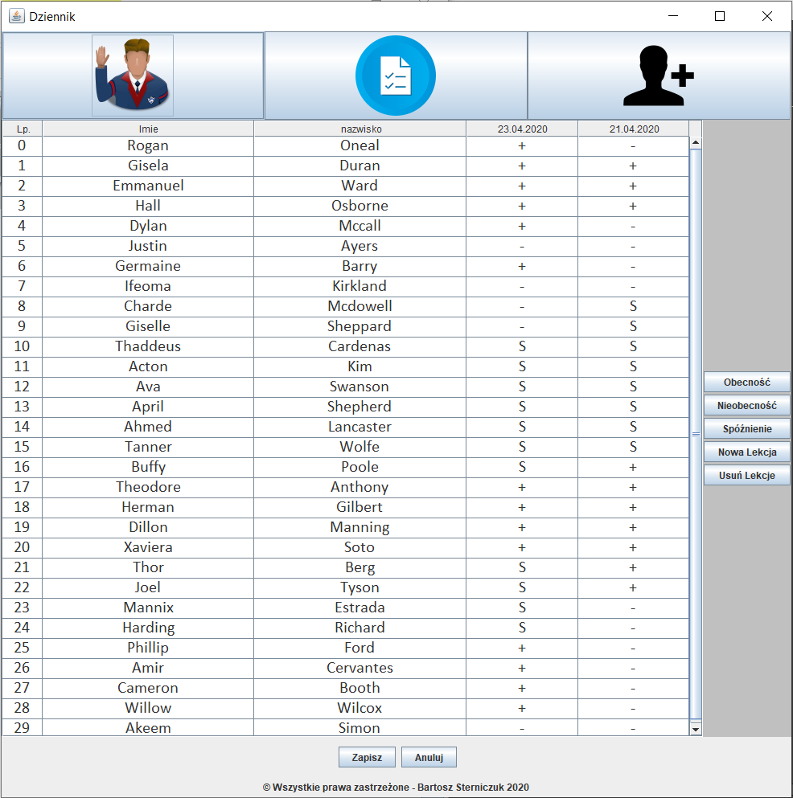

# Dziennik Lekcyjny
>This application help you with everyday conducting classes. 

## Table of contents
* [General info](#general-info)
* [Screenshots](#screenshots)
* [Technologies](#technologies)
* [Database-Requirements](#database-requirements)
* [Features](#features)
* [Status](#status)
* [Source](#source)
* [Contact](#contact)

## General info
This project was made using java in version 8 and extra libraries. Program is built on one of main design pattern - MVC, what cause that code is very clear. What is more there are used  following design-patterns: Singleton, Builder etc. All is  connecting with Data Base, which is based on MySql engine. The main target od this project is expanding knowledge about programming.

## Screenshots

## Technologies
* Java - version 8u241
* mysql-connector-java-8.0
* libmysql - mysqlnd 7.4.4 (using XAMMP)

## Database Requirements
Database isn't   relational and should be named "students" and include three table: 
* marks:
This table should the following columns: 
	1) id - auto increment number from 0
	2) Name 
	3) Surrname 
	4) Other columns include "present of pupils "
		
* present
	 1) id - auto increment number from 0
	2) Name 
	3) Surrname 
	4) Other columns include "marks of pupils "
* personaldata
	 1) id - auto increment number from 0
	2) Name 
	3) Surrname 
	4) Address
	5) Pesel 
	6) Tel
	7) eMail	

You can show sample  [@this ](./DB/students.sql)
## Features
List of features ready and TODOs for future development
*   Presence module
*   Evaluation module

To-do list:
*   Configuration module - acuta
*   The "configuration module" will be implemented

## Status
Project is:    on the finish

## Source
* [https://www.iconfinder.com/](https://www.iconfinder.com/) 

## Contact
Created by [@Bartistero](https://github.com/Bartistero/) - feel free to contact me!
